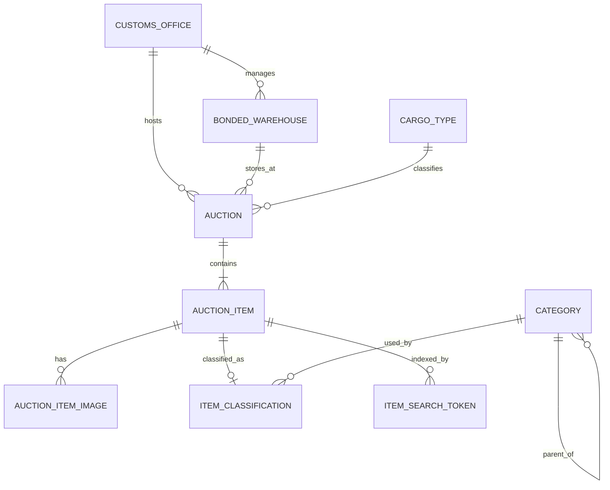
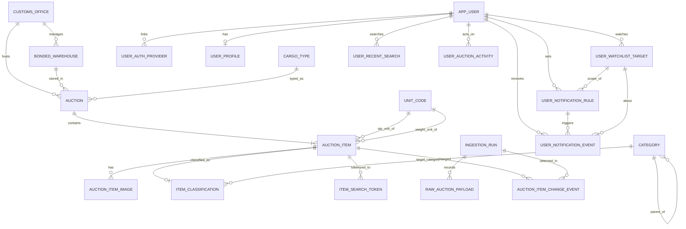

# Mermaid ER (IE Crow's Foot)

## 1) Core 8 tables (for one-slide summary)

```mermaid
erDiagram
    CUSTOMS_OFFICE ||--o{ BONDED_WAREHOUSE : manages
    CUSTOMS_OFFICE ||--o{ AUCTION : hosts
    BONDED_WAREHOUSE ||--o{ AUCTION : stores_at
    CARGO_TYPE ||--o{ AUCTION : classifies

    AUCTION ||--|{ AUCTION_ITEM : contains
    AUCTION_ITEM ||--o{ AUCTION_ITEM_IMAGE : has
    AUCTION_ITEM ||--o| ITEM_CLASSIFICATION : classified_as
    CATEGORY ||--o{ ITEM_CLASSIFICATION : used_by
    AUCTION_ITEM ||--o{ ITEM_SEARCH_TOKEN : indexed_by
    CATEGORY ||--o{ CATEGORY : parent_of
```

## 2) Full schema (DB + user + ops patch)

```mermaid
erDiagram
    CUSTOMS_OFFICE ||--o{ BONDED_WAREHOUSE : manages
    CUSTOMS_OFFICE ||--o{ AUCTION : hosts
    BONDED_WAREHOUSE ||--o{ AUCTION : stored_in
    CARGO_TYPE ||--o{ AUCTION : typed_as

    AUCTION ||--|{ AUCTION_ITEM : contains
    UNIT_CODE ||--o{ AUCTION_ITEM : qty_unit_of
    UNIT_CODE ||--o{ AUCTION_ITEM : weight_unit_of
    AUCTION_ITEM ||--o{ AUCTION_ITEM_IMAGE : has

    CATEGORY ||--o{ CATEGORY : parent_of
    AUCTION_ITEM ||--o| ITEM_CLASSIFICATION : classified_as
    CATEGORY ||--o{ ITEM_CLASSIFICATION : target_category
    AUCTION_ITEM ||--o{ ITEM_SEARCH_TOKEN : tokenized_to

    APP_USER ||--o{ USER_AUTH_PROVIDER : links
    APP_USER ||--o| USER_PROFILE : has
    APP_USER ||--o{ USER_WATCHLIST_TARGET : watches
    APP_USER ||--o{ USER_NOTIFICATION_RULE : sets
    USER_WATCHLIST_TARGET ||--o{ USER_NOTIFICATION_RULE : scope_of
    APP_USER ||--o{ USER_NOTIFICATION_EVENT : receives
    USER_NOTIFICATION_RULE ||--o{ USER_NOTIFICATION_EVENT : triggers
    USER_WATCHLIST_TARGET ||--o{ USER_NOTIFICATION_EVENT : about
    APP_USER ||--o{ USER_RECENT_SEARCH : searches
    APP_USER ||--o{ USER_AUCTION_ACTIVITY : acts_on

    INGESTION_RUN ||--o{ RAW_AUCTION_PAYLOAD : records
    AUCTION_ITEM ||--o{ AUCTION_ITEM_CHANGE_EVENT : changed
    INGESTION_RUN ||--o{ AUCTION_ITEM_CHANGE_EVENT : detected_in
```
